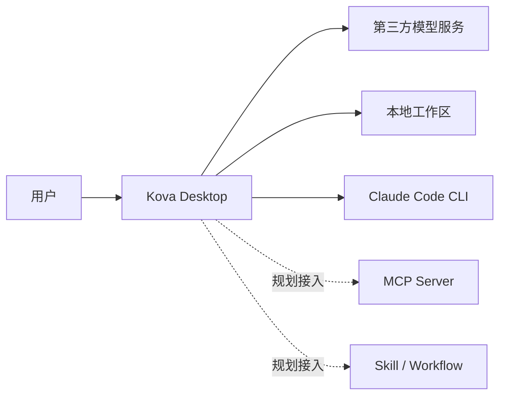
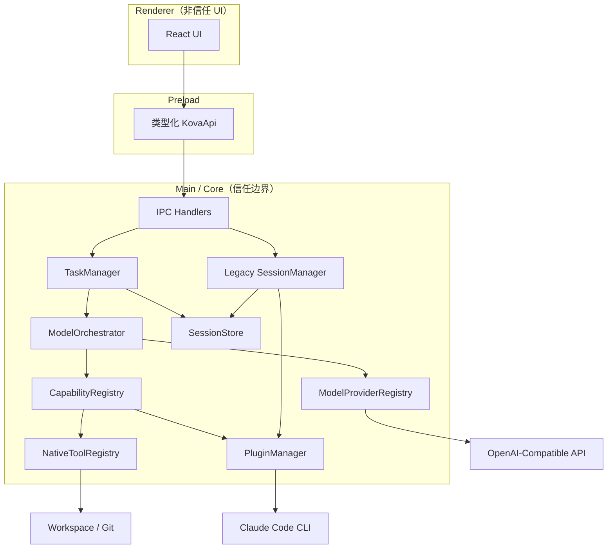
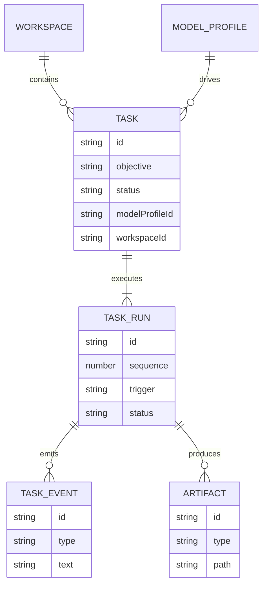
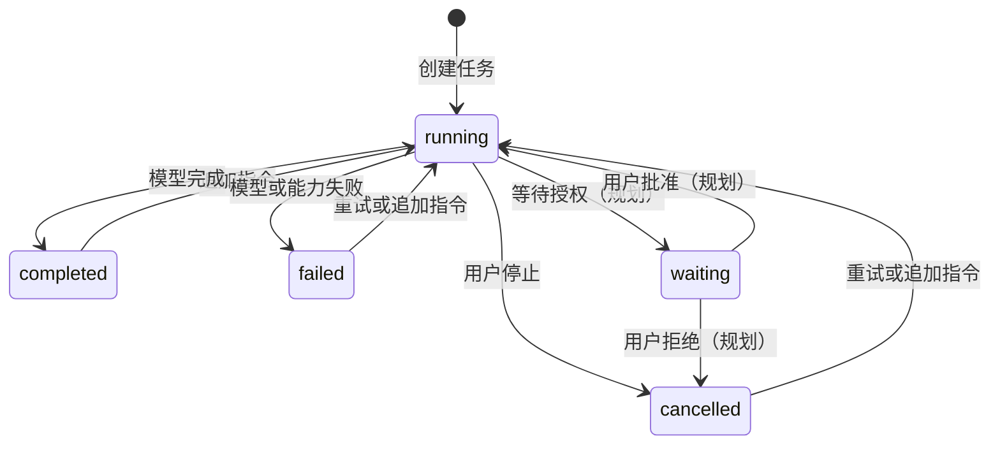
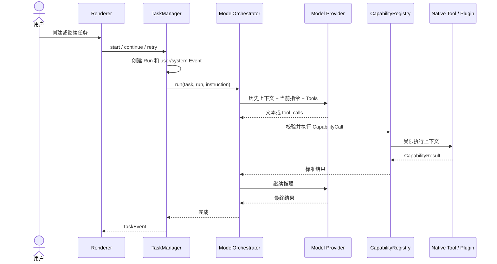
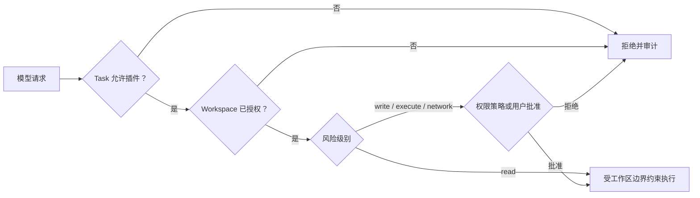

# Kova 当前架构

本文描述当前代码真实结构、运行边界和后续收口方向。产品目标与完整协议参见
[`TECHNICAL_SPEC.md`](./TECHNICAL_SPEC.md)。

## 1. 系统上下文

Kova 是本地优先的个人 AI 工作台。模型负责决策，本地 Capability 负责执行；Renderer
不能直接访问文件系统、凭证或启动进程。

## 2. Electron 容器与组件

`TaskManager → ModelOrchestrator → CapabilityRegistry` 是目标主链。`SessionManager` 是迁移期
保留的旧链路，后续应只读迁移历史数据并停止创建新 Session。

## 3. Task 领域关系

一个 Task 可以通过首次执行、追加指令和失败重试生成多个 Run。Event 只追加到对应 Run，
Task 状态由当前或最新 Run 推导。

## 4. Task 状态机

当前已经实现 `running/completed/failed/cancelled`、多 Run、追加指令和失败重试。
`waiting` 与交互式权限审批仍是下一阶段工作。

## 5. 模型能力调用时序

## 6. 权限与信任边界

当前已实现插件范围、工作区范围、Capability 风险和只读路径边界。交互式批准、逐次审批、
授权记忆和高风险动作策略尚未完成。

## 7. 实现状态

| 子系统 | 当前状态 | 下一步 |
| --- | --- | --- |
| Model Provider | OpenAI-Compatible Provider 可运行 | 连接测试、能力探测、流式输出 |
| Task / Run | 多 Run、继续、重试、停止 | 等待授权、恢复策略、分页 |
| Native Tools | list/read/search/git.status | Diff、结构化代码索引、受控写入 |
| Plugin | Claude Code 可运行 | Manifest 加载、启停、安装与授权 |
| MCP / Skill | 仅配置与存储 | 注册为 Capability / Workflow |
| Artifact | 类型和索引已定义 | 自动采集 Diff、测试报告与文件 |
| Persistence | 原子写 JSON | SQLite 追加事件与迁移 |
| Credential | 普通状态字段 | macOS Keychain |
| UI | 工作台、任务、能力、设置 | 权限卡、Run/Artifact 面板、工作区管理 |
| Tests | 构建与桌面验收 | 单元、集成、迁移和端到端测试 |

## 8. 收口顺序

1. 完成交互式权限审批和 `waiting` 状态。
2. 将 Claude Capability 从 Core 硬编码迁移到 Manifest 驱动插件。
3. 接入 Artifact、文件变更和测试结果。
4. 使用 SQLite 与 Keychain 替换 JSON 和明文凭证。
5. 将 MCP、Skill 和 Workflow 纳入统一 Task 执行链。
6. 停止创建 Legacy Session，并完成历史数据只读迁移。
